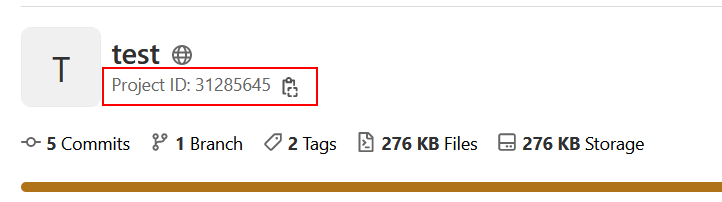

# MR-Tracker
[](https://codeclimate.com/github/MamaShip/MR-Tracker/maintainability)
[](https://lgtm.com/projects/g/MamaShip/MR-Tracker/alerts/)
[](https://pkg.go.dev/github.com/MamaShip/MR-Tracker)

Find changes between given versions by analyzing merge requests.

Currently only work for Gitlab MRs.

## Usage

### Before

This tool works on Gitlab APIs. Make sure your gitlab project visibility is **public**, OR generate a `private-token` (see [Gitlab docs](https://docs.gitlab.com/ee/user/project/settings/project_access_tokens.html)) for your project.

And the **project ID** is required for Gitlab APIs to work. You can find it from your project home page:

### Install

If you have golang environment, install by command:

```
go install github.com/MamaShip/MR-Tracker@latest
```

Or you can download the executable file from [release](https://github.com/MamaShip/MR-Tracker/releases) page. And put it in your `PATH` (or run it directly).

### Run

Parameters `-project`、`-start` and `-end` are the minimum requirements to run the program.

Type `MR-Tracker -h` to see detail instructions.

**Available options**:

| options    | input type | description                                                |
| ---------- | ---------- | ---------------------------------------------------------- |
| `-h`       |            | Print help info                                            |
| `-v`       |            | Print version                                              |
| `-site`    | string     | Set your Gitlab URL (default: `gitlab.com`)                |
| `-project` | int        | Set your project ID                                        |
| `-token`   | string     | Set your Gitlab API token for the project                  |
| `-branch`  | string     | This tool automatically analysis MRs on default branch. <br /> If you wanna track changes on other branches, set it by this option |
| `-start`   | string     | Set the tag where you want to compare difference from      |
| `-end`     | string     | Set the tag where you want to compare difference to        |
| `-post`    |            | If this flag is set, result will be posted as gitlab issue. <br /> This function needs Gitlab API token |

example:

```
MR-Tracker -site gitlab.com -project 31285645 -start v1.0.0 -end v1.0.1
```

## Inspired by
- [https://github.com/github-changelog-generator/github-changelog-generator](https://github.com/github-changelog-generator/github-changelog-generator)
- [https://github.com/eirture/walle](https://github.com/eirture/walle)